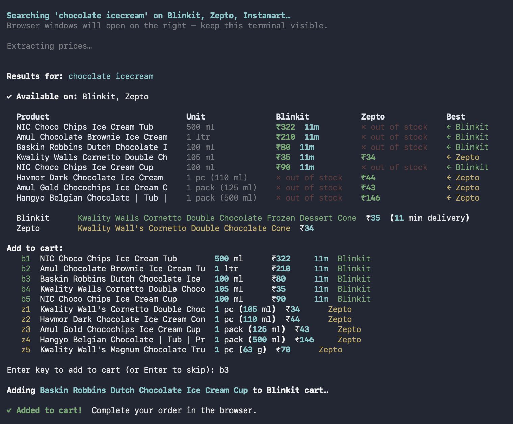

# 🛒 BuyLinkit

> *Blinkit + Zepto + Instamart — price compare and add to cart, all from your terminal.*

BuyLinkit searches multiple 10-minute delivery services simultaneously, shows you a side-by-side price table, and adds your chosen item to the cart — in the **same browser window** that did the search. No reopening, no guessing.



---

## Features

- **Parallel search** across Blinkit, Zepto, and Swiggy Instamart
- **Price comparison table** with delivery time and best-price highlight
- **Smart cart** — clicks ADD by position index on the already-open page, so the right item always gets added
- **Cheaper-elsewhere warning** — alerts you if another site has it for less before you confirm
- **Persistent browser profiles** — set your location and log in once, remembered forever
- **No payment automation** — you pay yourself; the bot just gets you to checkout

---

## Requirements

- macOS (uses persistent Chromium profiles)
- Python 3.10+
- A free [Groq API key](https://console.groq.com) — used for LLM agent decisions and price extraction

---

## Setup

```bash
git clone https://github.com/vvikas/buylinkit.git
cd buylinkit
./setup.sh
```

Then copy `.env.example` to `.env` and add your Groq key:

```bash
cp .env.example .env
# edit .env and set GROQ_API_KEY=your_key_here
```

---

## First-time login (once per machine)

Before searching, log in to each site and set your delivery location. The persistent browser profile saves everything permanently.

```bash
./login.sh                  # all 3 sites
./login.sh blinkit          # one site only
./login.sh blinkit zepto    # two sites
```

This opens each site's browser one at a time. Log in manually (phone + OTP), set your delivery address, then press Enter in the terminal. Done — you won't need to do this again.

If a site stops recognizing your session later:
```bash
./login.sh blinkit          # re-login to that site only
```

---

## Usage

```bash
./run.sh 'chocolate icecream'
./run.sh 'onions 1kg'
./run.sh 'amul butter'

# Search specific sites only
./run.sh 'milk' --sites blinkit zepto
```

### Workflow

```
Terminal                          Browser (right side of screen)
────────────────────────────────  ──────────────────────────────
$ ./run.sh 'chocolate icecream'
Searching 'chocolate icecream'…   [2 windows open on right half]
  ✓ Blinkit
  ✓ Zepto

Results for: chocolate icecream
  Product          Unit    Blinkit    Zepto     Best
  NIC Choco Chips  500 ml  ₹322 13m  —         ← Blinkit
  Kwality Walls    100 ml  ₹37  13m  ₹34  8m   ← Zepto

Add to cart (or Enter to skip): b2
💡 Zepto has it cheaper: ₹34 (z1) — Continue? [y/n]: n

Add to cart (or Enter to skip): z1
                                  [Blinkit window closes]
                                  [ADD clicked on Zepto]
                                  [cart page opens]
✓ Added to cart! Complete your
  order in the browser.
Press Enter when done…
```

To see agent debug steps (LLM decisions per page action):
```bash
BUYLINKIT_VERBOSE=1 ./run.sh 'milk'
```

---

## Project structure

```
buylinkit/
  main.py           # CLI entry — orchestrates the full flow
  agent.py          # LLM browser agent — reads DOM text + site hints, decides actions
  llm.py            # Groq client — price extraction from page text
  display.py        # Rich terminal table
  sites/
    session.py      # BrowserSession, login/location detection
    blinkit.py      # Blinkit search + cart (uses agent.do())
    zepto.py        # Zepto search + cart (uses agent.do())
    instamart.py    # Instamart search + cart (uses agent.do())
    hints/          # Static site profiles (.md) — UI layout per site
      blinkit.md
      zepto.md
      instamart.md
  setup.sh          # One-time install (venv + playwright)
  login.sh          # Login helper (wraps: main.py --login)
  run.sh            # Search wrapper (wraps: main.py)
  requirements.txt
```

---

## How it works

BuyLinkit uses a **pure LLM agent** — no hardcoded CSS selectors, no JS DOM hacks, no screenshots at runtime. The agent reads DOM text + static site hints to decide actions.

1. **Opens one persistent Chromium window per site** (positions them to the right so the terminal stays visible)
2. **LLM agent searches all sites in parallel** — `agent.do()` reads page text, LLM decides actions (click, type, press Enter), Playwright executes
3. **Sends page text to Groq** — extracts structured `{name, price, unit, available}` per product
4. **Renders a Rich comparison table** in the terminal
5. **On selection**: closes other windows, agent clicks the Nth ADD button (by exact index) on the search results page, navigates to cart
6. **Browser stays open** for you to review the cart and pay

### Agent architecture

Each site has a hint file (`sites/hints/{site}.md`) describing the UI layout — search bar behavior, product card structure, cart navigation. The agent reads DOM text + these hints, asks the LLM for one action at a time, and Playwright executes it. No vision model needed at runtime.

---

## Adding more sites

1. Create a site module in `sites/` with `search_raw()` and `add_to_cart()` — both use `agent.do()`:

```python
from agent import do

async def search_raw(page, query):
    await do(page, f"Search for '{query}'...", "mysite")
    return await page.inner_text("body")

async def add_to_cart(page, product_name, product_index=0):
    await do(page, f'Click ADD at index {product_index}', "mysite", max_steps=2)
    return True
```

2. Write a hint file at `sites/hints/mysite.md` describing the UI layout
3. Add the module to `SITE_CONFIG` in `main.py` with a window position

---

## License

MIT
